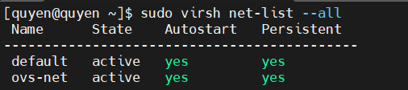

# Tìm hiểu về Open vSwitch

## 1. Open vSwitch là gì?

Open vSwitch (OVS) là một switch phần mềm đa tầng (multilayer virtual switch) mã nguồn mở, được thiết kế để chạy trên các hệ điều hành Linux, và thường dùng trong môi trường ảo hóa hoặc cloud.

- OVS hoạt động như một switch ảo cho các máy ảo (VM), container, hoặc các ứng dụng SDN (Software Defined Networking).

- Nó hỗ trợ nhiều giao diện quản lý và tiêu chuẩn mạng (như VLAN, OpenFlow), cho phép tích hợp linh hoạt với các nền tảng ảo hóa (KVM, Xen, VirtualBox) và các hệ thống Cloud (OpenStack, Kubernetes).

- Open vSwitch có thể chạy cả trong kernel space (nhân Linux) để đạt hiệu năng cao, và trong user space (kết hợp với DPDK) để xử lý gói tin tốc độ cao trong môi trường NFV (Network Function Virtualization).


## 2. Các chức năng chính của OVS

- Chuyển mạch ảo (Switching): Hỗ trợ VLAN 802.1Q, trunk/access port, bonding NIC, LACP.

- Giám sát mạng: NetFlow, sFlow, port mirroring.

- QoS: Quản lý băng thông, giới hạn tốc độ (policing).

- Tunneling: Hỗ trợ GRE, VXLAN, Geneve… để tạo mạng overlay.

- Tích hợp SDN: Hỗ trợ OpenFlow để lập trình điều khiển mạng.

- Quản lý cấu hình: Database giao dịch, API C/Python.

- Hiệu năng cao: Chạy trong kernel hoặc userspace (DPDK).

## 3. Cấu trúc Open vSwitch

### 3.1 Tổng quan cấu trúc OVS

Open vSwitch được chia thành hai lớp chính:

- Kernel space (Datapath)

    - Xử lý gói tin (fast path).

    - Chứa flow table để quyết định hành động với gói tin.

    - Là module trong Linux kernel (`openvswitch.ko`).

- User space (Control plane)

    - Các tiến trình quản lý logic của OVS.

    - Gồm `ovs-vswitchd` (switch daemon), `ovsdb-server` (cơ sở dữ liệu).

    - Tương tác với kernel qua Netlink.

    - Cho phép SDN controller quản lý qua OpenFlow và OVSDB protocol.

### 3.2 Thành phần chi tiết trong OVS


**1.** Kernel Datapath (Data Plane)

- Là phần lõi, nằm trong kernel Linux.

- Chức năng:

    - Xử lý gói tin theo flow table (match → action).

    - Forward gói nhanh mà không cần lên user space.

    - Khi không tìm thấy flow, sẽ upcall gói lên `ovs-vswitchd`.

- Các khái niệm:

    - Flow: rule để xử lý gói (theo MAC, IP, VLAN, port...).

    - Action: forward, drop, encapsulate (VXLAN, GRE...), modify header.

**2.** User Space Daemons

- ovs-vswitchd

    - Thành phần điều khiển chính (control plane).

    - Nhận gói từ kernel khi không có flow.

    - Liên lạc với SDN Controller qua OpenFlow.

    - Cài đặt rule mới vào kernel datapath.

- ovsdb-server

    - Quản lý cơ sở dữ liệu cấu hình (OVSDB).

    - Lưu thông tin về bridge, port, interface, QoS, mirror...

    - Cung cấp API cho công cụ quản lý (`ovs-vsctl`) hoặc controller (OVSDB protocol).

**3.** Công cụ quản lý (CLI tools)

- ovs-vsctl: cấu hình bridge, port, VLAN.

- ovs-ofctl: quản lý flow theo chuẩn OpenFlow.

- ovs-dpctl: làm việc trực tiếp với datapath (debugging).

- ovs-appctl: gửi lệnh điều khiển cho tiến trình ovs-vswitchd.

- ovsdb-client, ovsdb-tool: quản lý database OVSDB.

**4.** Giao diện với bên ngoài

- OpenFlow: chuẩn điều khiển SDN (controller như Ryu, ONOS, ODL).

- OVSDB Protocol: quản lý cấu hình OVS từ xa.

- sFlow/NetFlow: giám sát lưu lượng.

### 3.3 Luồng xử lý gói tin trong OVS

Gói đến từ NIC/vNIC (NetDevice).

Kernel datapath kiểm tra flow table.

- Nếu match -> thực hiện action ngay (forward/drop/modify).

- Nếu không match → upcall gói lên `ovs-vswitchd`.

ovs-vswitchd quyết định cách xử lý:

- Tự áp dụng rule có sẵn.

- Hoặc hỏi SDN controller (qua OpenFlow).

Rule mới được cài vào datapath flow table.

Gói ban đầu được xử lý lại và các gói sau cùng flow đi nhanh trong kernel.

### 3.4 Cấu trúc dữ liệu quan trọng


- **Bridge:** switch ảo (L2 domain).

- **Port:** cổng kết nối vào bridge (có thể là NIC vật lý, tap, tunnel).

- **Interface:** gắn vào port, đại diện cho NIC.

- **Flow Table:** tập hợp rule xử lý gói.

- **Database (OVSDB):** chứa cấu hình quản trị, không phải dữ liệu gói.

## 4. Cấu hình OVS

### 4.1 Câu lệnh ovs-vsctl

Sử dụng câu lệnh ovs-vsctl để làm việc với Open vSwitch database. ovs-vsctl hiểu như là câu lệnh để querying tới database của OVS. Do đó, mọi sự thay đổi đều được lưu lại vào database. (Bền vững – tức là khác với Linux bridge, switch tạo từ OVS sẽ vẫn tồn tại và giữ được cấu hình khi máy host chủ khởi động lại)

Syntax:

    ovs-vsctl  [options]  -- [options] command [args] [-- [options] command [args]]...

### 4.2 Open Vswtich command

init : các bước ban đầu thiết lập database, nếu nó trống. Nếu trước đó đã cấu hình và được lưu trong database thì câu lệnh này sẽ không cần thiết nữa. Bất kể sự tác động nào của câu lệnh ovs-vsctl đều tự động thiết lập initalizes nếu database của OVS đang trống. Câu lệnh này cung cấp các bước thiết lập ban đầu cho database mà không cần xử lý thêm bất kì câu lệnh nào.

show : Hiển thị ngắn gọn nội dung cấu hình có trong database.


**Bridge Commands:**

    [--may-exist] add-br <bridge-name>

- Tạo một switch mới có tên `<bridge-name>`. Ban đầu, switch này sẽ không có port nào cả (hoặc là chỉ một interface mang bridge)

- Nếu không có tùy chọn `--may-exist`, việc cố gắng tạo ra một bridge đã có (trùng tên) sẽ lỗi. Với tùy chọn này, câu lệnh này sẽ không xử lý gì cả nếu một bridge như vậy đã tồn tại.

```bash
[--may-exist] add-br <fake-bridge> <parent-bridge> <vlan_id>
```

- Tạo một fake bridge hỗ trợ vlan. parent-brige phải tồn tại trước khi tạo fake bridge. Fake bridge mới này sẽ hoạt động ở chuẩn Vlan 802.1Q.

- Để kiểm tra vlan_id của fake bridge sử dụng lệnh: `ovs-vsctl br-to-vlan <fake-bridge>`

- Hiển thị parent bridge của fake bridge sử dụng lệnh: `ovs-vsctl br-to-parent <fake-bridge>`

```bash
[--if-exists] del-br <bridge>
```

- Xóa một bridge và toàn bộ port trên bridge đó. Nếu là một bridge bình thường thì câu lệnh này đồng thời xóa hết cả fake bridge trên nó, và các port của nó.

- Tùy chọn `--if-exists`, nếu có thử xóa một bridge không còn tồn tại sẽ gây lỗi. Với tùy chọn này, nếu cố xóa một bridge không tồn tại thì sẽ không có hiệu lực gì xảy ra.

```bash
[--real|--fake] list-br : Liệt kê tất cả real hoặc fake bridge.
```

`br-to-vlan <bridge>`: Hiển thị thông tin vlan_id nếu đó là fake bridge, nếu là real bridge thì không hiển thị 0 (không có vlan nào cả)

`br-to-parent <bridge>`: Hiển thị thông tin parent bridge của fake bridge, nếu đó là real bridge thì hiển thì chính nó.

**Port Command:**

Những câu lệnh sau sẽ kiểm tra và điểu khiển Open Vswitch port. Lệnh này sẽ xử lý và coi port bonding là thực thể đơn.

- Liệt kê tất cả các port của bridge, thành từng dòng. Không liệt kê các local port:

    ```bash
    list-ports <bridge_name>
    ```

- Tạo trên bridge_name một port mới tên `<port_name>` từ thiết bị mạng cùng tên:

    ```bash
    [--may-exist] add-port <bridge_name> port [column[:key]=value]...
    ```

    Ví dụ: `ovs-vsctl add-port br0 eth0`

- Tạo trên `<bridge_name>` một port mới tên `<port_name>` mà bond các interface liệt kê sau đó lại với nhau. Ít nhất 2 interface phải được xác định để tạo port bond. Với tùy chọn `--fake-iface`, một fake interface với tên port sẽ được tạo:

    ```bash
    [--fake-iface] add-bond <bridge_name> <port_name> iface... [column[:key]=value]...
    ```

- Xóa port:

    ```bash
    [--if-exists] del-port [<bridge_name>] <port_name>
    ```

    Nếu `<bridge_name>` không có, port được xóa khỏi bất kì bridge nào chứa nó, nếu brdige_name được xác định, thì bridge đó phải chứa port đó.

- Xóa port tên iface hoặc có interface tên là <iface_name>:

    ```bash
    [--if-exists] --with-iface del-port [<bridge_name>] <iface_name>
    ```

- Hiển thị thông tin tên của bridge chứa `port_name`:

    ```bash
    port-to-br <port_name>
    ```

**Interfaces Commands:**

Các câu lệnh kiểm tra các interface được gán trên một Open Vswitch bridge. Các lệnh này sẽ xử lý port bonding như là một tập hợp của 2 hoặc nhiều interface hơn là chỉ coi nó như một cổng đơn.

- Liệt kê interface:

    ```bash
    list-ifaces <bridge_name>
    ```

    Liệt kê tất cả các interface trong `bridge_name`. `Local port` sẽ không được list ra.

- In ra tên của bridge chứa interface `<iface_name>`:

    ```bash
    iface-to-br <iface_name>
    ```

**Database Commands:**

Là các câu lệnh truy vấn và modify các nội dung trong các bảng của ovsdb. Mỗi command đều có tác động tới các thông số của các thực thể (được hiểu trong database là các table). Một số câu lệnh sau cho phép thay đổi các thông số của table. Một số table trong ovsdb:

- `Open_vSwitch`: Thông tin cấu hình cho ovs-vswitchd. Table này chỉ có duy nhất một bản ghi.

- `Bridge`: Các thông tin cấu hình cho một bridge trong Open Vswitch. Các hàng được định danh theo tên bridge.

- `Port`: Thông tin về các port. Các hàng được định danh theo tên port.

- `Interface`: Thông tin về các interface của các thiết bị mạng được gán với port. Các hàng được định danh bởi tên interface.

Và một số table khác như: `Flow_Table`, `QoS`, `Queue`, `Mirror`, `Controller`, `Manager`, `NetFlow`, `SSL`, `sFlow`, `IPFIX`, `Flow_Sample_Collector_Set`, `AutoAttach`.

## 5. Lab 

### 5.1 Cài đặt Open vSwitch

    sudo dnf install -y openvswitch

Bật/khởi động dịch vụ:

    sudo systemctl enable --now ovsdb-server ovs-vswitchd

Kiểm tra trạng thái:

    systemctl status ovsdb-server ovs-vswitchd
    ovs-vsctl --version


### 5.2 Tạo bridge OVS

    # 1) tạo bridge br0
    sudo nmcli connection add type ovs-bridge conn.id br0 ifname br0

    # 2) tạo ovs-port cho interface vật lý
    sudo nmcli connection add type ovs-port conn.id ovs-port-ens160 ifname ens160 master br0

    # 3) tạo connection ethernet slave (để NM biết đây là slave)
    sudo nmcli connection add type ethernet conn.id ens160-slave ifname ens160 master ovs-port-ens160

    # 4) cho phép br0 lấy IP bằng DHCP (nếu muốn DHCP)
    sudo nmcli connection modify br0 ipv4.method auto ipv6.method ignore

    # 5) bật autoconnect cho các connection để tồn tại sau reboot
    sudo nmcli connection modify br0 connection.autoconnect yes
    sudo nmcli connection modify ovs-port-ens160 connection.autoconnect yes
    sudo nmcli connection modify ens160-slave connection.autoconnect yes

    # 6) up br0
    sudo nmcli connection up br0


Kiểm tra:

    nmcli connection show


    ip a


    ovs-vsctl show
    ovs-vsctl list-ports br0


### 5.3 Tích hợp OVS bridge vào libvirt (cho VM bridge trực tiếp tới OVS)

Tạo file XML mạng cho libvirt để libvirt biết dùng OVS bridge (virtualport type='openvswitch'):

    cat > /tmp/ovs-net.xml <<'EOF'
    <network>
    <name>ovs-net</name>
    <forward mode='bridge'/>
    <bridge name='br0'/>
    <virtualport type='openvswitch'/>
    </network>
    EOF

    # Đăng ký với libvirt
    sudo virsh net-define /tmp/ovs-net.xml
    sudo virsh net-start ovs-net
    sudo virsh net-autostart ovs-net

Kiểm tra:

    virsh net-list --all



### 5.4 Gắn mạng qua OVS bridge

    sudo virsh attach-interface kvm01 --type network --source ovs-net --model virtio --config --live


Khi VM khởi động, libvirt tạo vnetX (tap) trên host:

    ovs-vsctl list-ports br0


### 5.5 Kiểm tra kết nối 

Từ kvm01 ping ra ngoài mạng:

