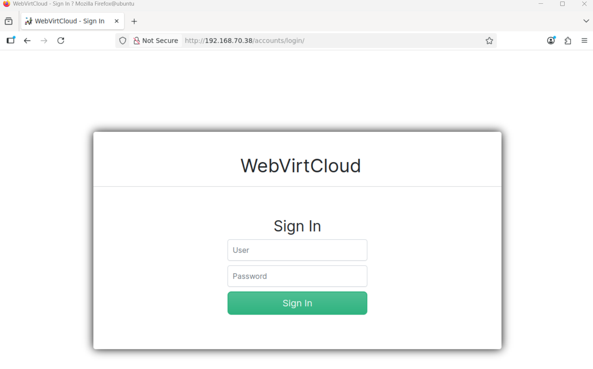
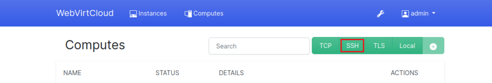
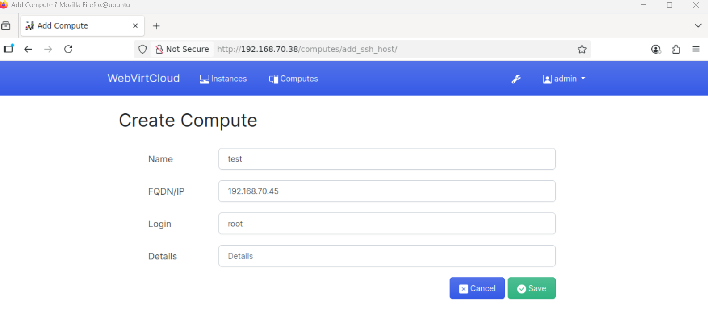
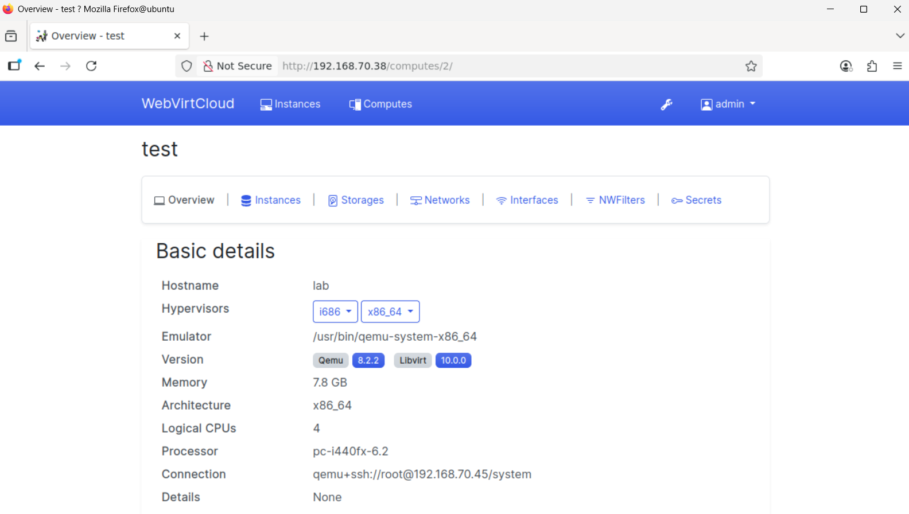
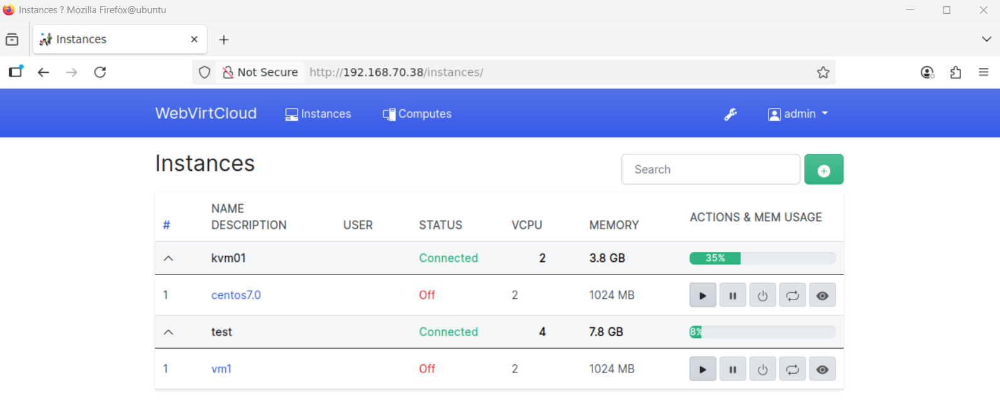

# Cài đặt WebVirtCloud

**Bước 1:** Cài đặt các gói phụ thuộc

Trên hệ thống Ubuntu cục bộ, bạn cần cài đặt tất cả các gói phụ thuộc cần thiết để build và chạy WebVirtCloud trên Ubuntu 24.04 (Noble Numbat). Bắt đầu với việc cập nhật hệ thống:

    sudo apt update && sudo apt upgrade -y

Sau khi hệ thống đã được cập nhật, tiến hành cài đặt các gói phụ thuộc:

    sudo apt install -y git libvirt-dev libxml2-dev libxslt1-dev \
    libxslt1-dev zlib1g-dev libffi-dev libssl-dev supervisor gcc \
    pkg-config libsasl2-dev libssl-dev libldap2-dev 

**Bước 2:** Cài đặt Python và các module cần thiết

Phiên bản Python mới nhất trên Ubuntu 24.04 có thể sử dụng để cài đặt WebVirtCloud. Cài đặt bằng lệnh:

    sudo apt install python3 python3-pip python3-venv

Xác nhận phiên bản Python:

    python --version

**Bước 3:** Cài đặt Nginx Web Server

Sử dụng nginx để chạy website WebVirtCloud. Cài đặt bằng lệnh:

    sudo apt install nginx

Khởi động và bật dịch vụ nginx:

    sudo systemctl enable --now nginx

Kiểm tra trạng thái dịch vụ:

    systemctl status nginx

**Bước 4:** Cài đặt WebVirtCloud trên Ubuntu 24.04

Dùng git để tải mã nguồn mới nhất của WebVirtCloud:

    git clone https://github.com/retspen/webvirtcloud.git
    cd webvirtcloud

Tạo file `settings.py` từ template có sẵn:

    cp webvirtcloud/settings.py.template webvirtcloud/settings.py

Sinh khóa bí mật bằng script Python:

    SECRET=$(python3 conf/runit/secret_generator.py)

Thêm khóa vào file settings.py:

    sed -i "s|SECRET_KEY = \"\"|SECRET_KEY = \"$SECRET\"|" webvirtcloud/settings.py

Mở file `settings.py` và thêm hostname của hệ thống vào danh sách `CSRF_TRUSTED_ORIGINS`:

    CSRF_TRUSTED_ORIGINS = ['http://localhost','http://webvirtcloud.example.com']

Thay webvirtcloud.example.com bằng hostname hoặc địa chỉ IP thực tế của server

Sao chép cấu hình nginx và supervisor:

    sudo cp conf/nginx/webvirtcloud.conf /etc/nginx/conf.d
    sudo cp conf/supervisor/webvirtcloud.conf /etc/supervisor/conf.d

Chỉnh sửa file cấu hình nginx:

    sudo nano /etc/nginx/conf.d/webvirtcloud.conf

Cập nhật `server_name` và cấu hình log:

    server {
        listen 80;

        server_name webvirtcloud.example.com;
        access_log /var/log/nginx/webvirtcloud-access_log;
        error_log /var/log/nginx/webvirtcloud-error_log;
    }

Chuyển thư mục webvirtcloud sang `/srv`:

    cd ..
    sudo mv webvirtcloud /srv

Tạo môi trường ảo Python:

    cd /srv/webvirtcloud
    python3 -m venv venv

Kích hoạt môi trường ảo và cài đặt các thư viện Python:

    source venv/bin/activate
    pip3 install -r conf/requirements.txt

Thực hiện migrate và tạo static files:

    pip3 install setuptools
    python3 manage.py migrate
    python3 manage.py collectstatic --noinput

Phân quyền thư mục cho user www-data:

    sudo chown -R www-data:www-data /srv/webvirtcloud

Khởi động và bật dịch vụ nginx và supervisor:

    sudo systemctl enable nginx supervisor
    sudo systemctl restart nginx supervisor

Kiểm tra trạng thái các dịch vụ do supervisor quản lý:

    sudo supervisorctl status

Kết quả mong đợi:

    novncd                           RUNNING   pid 79146, uptime 3 days, 3:00:20
    socketiod                        RUNNING   pid 79147, uptime 3 days, 3:00:20
    webvirtcloud                     RUNNING   pid 79148, uptime 3 days, 3:00:20

Xác nhận dịch vụ đang lắng nghe trên cổng 8000:

    ss -tunelp | grep 8000

**Bước 5:** Truy cập Dashboard WebVirtCloud

Mở trình duyệt và truy cập địa chỉ:

    http://yourserverhostname

Thay yourserverhostname bằng hostname hoặc IP của server bạn đã cấu hình.

Thông tin đăng nhập mặc định

- Username: admin

- Password: admin

**Bước 6:** Thêm máy chủ Compute (Compute host)

Cấu hình trên máy chủ KVM (Ubuntu)

Sau khi đã cấu hình máy chủ hypervisor, Cài đặt các gói phụ thuộc khác

    sudo apt install sasl2-bin python3-guestfs supervisor -y

Cấu hình libvirt để cho phép kết nối từ WebVirtCloud

    sudo sed -i 's/: gssapi/: digest-md5/g' /etc/sasl2/libvirt.conf
    sudo sed -i 's/#sasldb_path/sasldb_path/g' /etc/sasl2/libvirt.conf
    sudo sed -i 's/#listen_tls/listen_tls/g' /etc/libvirt/libvirtd.conf
    sudo sed -i 's/#listen_tcp/listen_tcp/g' /etc/libvirt/libvirtd.conf
    sudo sed -i 's/#auth_tcp/auth_tcp/g' /etc/libvirt/libvirtd.conf
    sudo sed -i 's/#auth_unix_rw = "polkit"/auth_unix_rw = "none"/g' /etc/libvirt/libvirtd.conf

Cho phép kết nối VNC từ WebVirtCloud instance

    sudo sed -i 's/#[ ]*vnc_listen.*/vnc_listen = "0.0.0.0"/g' /etc/libvirt/qemu.conf
    sudo sed -i 's/#[ ]*spice_listen.*/spice_listen = "0.0.0.0"/g' /etc/libvirt/qemu.conf

Cấu hình gstfsd

    wget https://raw.githubusercontent.com/retspen/webvirtcloud/master/conf/daemon/gstfsd
    chmod +x gstfsd
    sudo mv gstfsd /usr/local/bin/gstfsd 
    wget https://raw.githubusercontent.com/retspen/webvirtcloud/master/conf/supervisor/gstfsd.conf
    chmod +x gstfsd.conf
    sudo mv gstfsd.conf /etc/supervisor/conf.d/gstfsd.conf

Khởi động lại dịch vụ (libvirtd & supervisor)

    sudo systemctl enable libvirtd supervisor
    sudo systemctl restart libvirtd supervisor
    sudo systemctl status libvirtd supervisor

Xác nhận dịch vụ supervisor:

    sudo supervisorctl status

Ví dụ kết quả:

    gstfsd   RUNNING   pid 16080, uptime 0:00:48

Kiểm tra dịch vụ libvirtd cũng phải ở trạng thái running:

    systemctl status libvirtd

Sinh và sao chép SSH Keys

Chuyển sang người dùng www-data và sinh cặp khóa SSH:

    sudo mkdir -p /var/www/.ssh 
    sudo chown -R www-data:www-data /var/www/.ssh
    sudo -u www-data ssh-keygen

Sao chép khóa công khai sang máy chủ KVM:

    sudo -u www-data ssh-copy-id -i /var/www/.ssh/id_ed25519.pub root@192.168.70.45

Để thêm một KVM host, truy cập vào menu Computes -> SSH.

