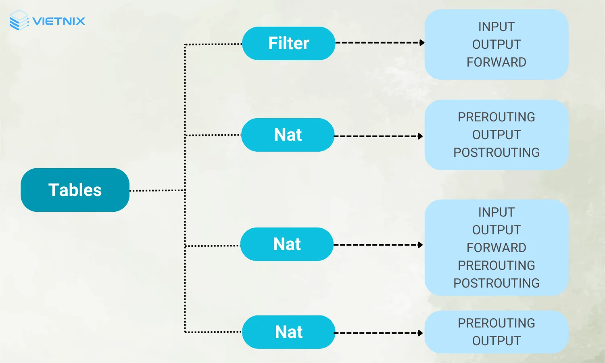
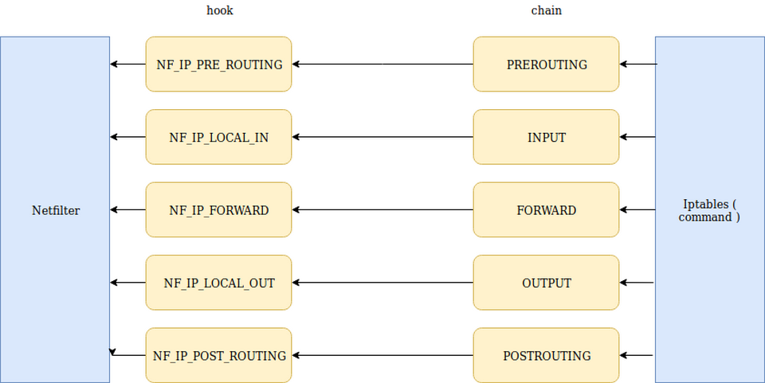
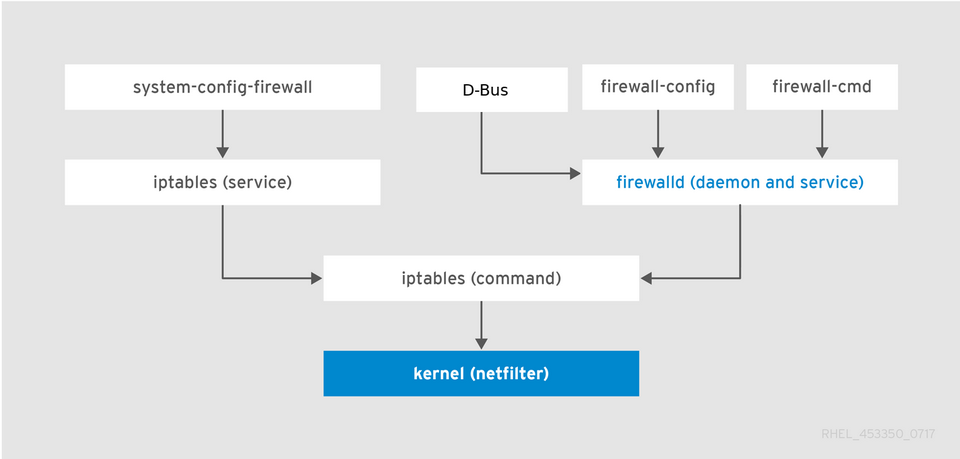

# Tìm hiểu về iptables

## 1. IPtables là gì?

IPtables là một công cụ quản lý tường lửa trong hệ thống Linux. Nền tảng cho phép người dùng quản lý và điều khiển luồng dữ liệu trên mạng bằng cách thiết lập các quy tắc và chính sách bảo mật dựa trên địa chỉ IP, giao thức, cổng và các tiêu chí khác.

IPtables hoạt động dựa trên việc kiểm tra và xử lý các gói tin dữ liệu khi chúng di chuyển qua hệ thống mạng. Người dùng có thể sử dụng IPtables để thiết lập các quy tắc cho việc chặn, chuyển hướng hoặc cho phép các gói tin dữ liệu dựa trên nhiều yếu tố khác nhau.

Trên hệ thống IPtables hỗ trợ người dùng tạo và quản lý các chains (chuỗi) và rules (quy tắc) để kiểm soát việc truy cập mạng. Công cụ này cung cấp cơ chế hoạt động linh hoạt để thực hiện các điều kiện bảo mật mạng. Đồng thời, nền tảng còn là một phần quan trọng của việc bảo vệ hệ thống mạng trong môi trường Linux.

## 2. Các thành phần của IPtables

***Tables (Bảng) ***

IPtables sử dụng bốn bảng chính để tổ chức các quy tắc và quản lý gói tin dữ liệu. Các bảng bao gồm:

- Raw: Cho phép thay đổi các header của gói tin.

- Filter: Sử dụng để quyết định liệu gói tin có được chấp nhận, từ chối hoặc chuyển hướng.

- NAT: Sử dụng để thực hiện Network Address Translation (NAT), cho phép chuyển đổi địa chỉ IP và cổng.

- Mangle: Cho phép thay đổi các header của gói tin với các quy tắc chuyên biệt.

***Chains (Chuỗi)***

Các chain trong IPtables đóng vai trò quan trọng trong quyết định cách thức xử lý các gói tin dữ liệu khi chúng di chuyển qua hệ thống mạng. Dưới đây giới thiệu cơ sở ứng dụng các chains chính trong IPtables:

- INPUT chain (Chuỗi INPUT): Chuỗi này được áp dụng cho tất cả các gói tin dữ liệu đang vào hệ thống từ mạng bên ngoài. Nền tảng quyết định xem liệu các gói tin này có được chấp nhận (ACCEPT) và điều hướng tới ứng dụng đích, hoặc bị từ chối (DROP/REJECT). Các quy tắc trong chain này thường kiểm tra địa chỉ nguồn, cổng đích và giao thức.

- OUTPUT chain (Chuỗi OUTPUT): Được áp dụng cho các gói tin dữ liệu đi ra từ hệ thống tới mạng bên ngoài. Tại đây, quy tắc được thực hiện để quyết định liệu gói tin được chấp nhận và gửi đi, hoặc bị từ chối.

- FORWARD chain (Chuỗi FORWARD): Chuỗi này xử lý các gói tin dữ liệu chuyển tiếp qua hệ thống. Điều này có nghĩa là nền tảng không tiến hành giao dịch trực tiếp giữa hệ thống và mạng bên ngoài. Forward chain thường được sử dụng trong các cấu hình máy chủ định tuyến hoặc cấu hình máy chủ chuyển tiếp.

- PREROUTING chain (Chuỗi PREROUTING): Đây là một chuỗi được áp dụng trong quá trình xử lý gói tin trước khi nó được định tuyến. Công cụ thường được sử dụng trong các trường hợp NAT (Network Address Translation) để thay đổi địa chỉ IP hoặc cổng nguồn của gói tin.

- POSTROUTING chain (Chuỗi POSTROUTING): Chuỗi này thường được áp dụng trong quá trình xử lý gói tin sau khi nó đã được định tuyến. Nền tảng thường được sử dụng trong các trường hợp NAT để thay đổi địa chỉ IP hoặc cổng đích của gói tin.

***Targets (Mục tiêu)***

Các mục tiêu (targets) trong IPtables biểu thị hành động cụ thể mà một gói tin sẽ thực hiện khớp với một quy tắc trong chains. Những mục tiêu chính trong IPtables:

- ACCEPT: Mục tiêu này cho phép gói tin được chấp nhận và chuyển tiếp trong hệ thống mạng. Nền tảng cấp phép cho gói tin theo quy tắc được xác định.

- DROP: Khi mục tiêu được đặt là DROP, gói tin sẽ bị từ chối mà không phản hồi cho người gửi. Điều này có nghĩa là gói tin sẽ bị loại bỏ một cách im lặng và không được xuất khẩu ra ngoài mạng.

- REJECT: Mục tiêu này tương tự như DROP nhưng công cụ sẽ gửi một tin nhắn báo lỗi trở lại cho người gửi. Điều này thông báo rằng gói tin đã bị từ chối và không được chấp nhận.

- DNAT (Destination Network Address Translation): Mục tiêu này cho phép thay đổi địa chỉ đích của gói tin khi nó đi qua tường lửa. Nền tảng thường được sử dụng trong các tình huống NAT để chuyển hướng gói tin đến một địa chỉ đích mới.

- SNAT (Source Network Address Translation): Mục tiêu này cho phép thay đổi địa chỉ nguồn của gói tin khi nó đi qua tường lửa. SNAT được ứng dụng trong các tình huống NAT để chuyển đổi địa chỉ IP nguồn.

- MIRROR: Mục tiêu này cho phép sao chép và gửi gói tin đến một địa chỉ khác trong mạng. Công nghệ cho phép theo dõi và kiểm tra gói tin một cách song song với quá trình xử lý thông thường.

**Rules (Quy tắc)**

Bộ quy tắc IPtables là các điều kiện được xác định để quyết định cách thức xử lý gói tin dữ liệu. Người dùng có thể cân nhắc một số quy tắc cụ thể dưới đây:

- Địa chỉ IP nguồn và đích: Các quy tắc có thể được xác định dựa vào địa chỉ IP nguồn và/hoặc đích của gói tin. Điều này cho phép quản trị mạng thiết lập các chính sách dựa trên nguồn và đích của dữ liệu

- Cổng giao thức: Quy tắc có thể được áp dụng dựa vào cổng sử dụng trong giao thức (TCP, UDP, ICMP, vv.). Hệ thống quản trị mạng kiểm soát truy cập dựa trên loại giao thức và cổng sử dụng.

- Mục tiêu (target): Quy tắc cũng định nghĩa mục tiêu xử lý của gói tin, tức là hành động cụ thể sẽ được thực hiện khi gói tin khớp với quy tắc. Các mục tiêu bao gồm ACCEPT, DROP, REJECT, DNAT, SNAT, và MIRROR.

- Chuỗi (chain): Quy tắc còn phải xác định chuỗi mà nó sẽ áp dụng, tức là nó sẽ được kiểm tra trong chuỗi INPUT, OUTPUT, FORWARD hoặc các chuỗi tùy chỉnh khác.

- Thời gian: Các quy tắc cũng có thể áp dụng hoặc không áp dụng theo định dạng thời gian nhất quán, chẳng hạn như thời gian cụ thể trong ngày, tuần hoặc tháng.

### 3. Các tùy chọn cơ bản

**Tùy chọn để chỉ định thông số IPtables:**

- `-p`, `--protocol`: Cho phép bạn chỉ định giao thức dữ liệu (ví dụ: tcp, udp, icmp).
- `-s`,` --source`: Được sử dụng để xác định địa chỉ IP nguồn của gói tin.
- `-d`, `--destination`: Xác định địa chỉ IP đích cho gói tin.
- `--sport`: Chỉ định cổng nguồn (port number) của gói tin.
- `--dport`: Xác định cổng đích (port number) của gói tin.
- `-j`, `--jump`: Chỉ định mục tiêu xử lý sau khi gói tin khớp với quy tắc (ví dụ: ACCEPT, DROP).
- `-i`, `--in-interface`: Xác định interface đầu vào mà gói tin sử dụng.
- `-o`, `--out-interface`: Được sử dụng để xác định interface đầu ra cho gói tin.

**Tùy chọn để thao tác với chain trong IPtables:**

- `-A`, `--append`: Thêm một rule vào cuối của chain.
- `-I`, `--insert`: Chèn một rule vào vị trí cụ thể trong chain.
- `-D`, `--delete`: Xóa một rule khỏi chain.
- `-R`, `--replace`: Thay thế một rule trong chain bằng rule mới.
- `-N`, `--new-chain`: Tạo một chain mới.
- `-X`, `--delete-chain`: Xóa một chain khỏi bảng.
- `-P`, `--policy`: Thiết lập chính sách mặc định cho một chain.
- `-E`, `--rename-chain`: Đổi tên cho một chain.

**Tùy chọn để thao tác với rule trong IPtables:**

- `-A`, `--append`: Thêm một rule vào cuối của chain.
- `-I`, `--insert`: Chèn một rule vào vị trí cụ thể trong chain.
- `-D`, `--delete`: Xóa một rule khỏi chain.
- `-R`, `--replace`: Thay thế một rule trong chain bằng rule mới.
- `-C`, `--check`: Kiểm tra xem gói tin có khớp với rule của chain hay không.
- `-L`, `--list`: Liệt kê các rule trong chain.
- `-F`, `--flush`: Xóa tất cả các rule trong chain.
- `-Z`, `--zero`: Reset bộ đếm cho tất cả các rule hoặc một rule cụ thể.
- `-N`, `--new`: Tạo ra một user-defined chain mới.
- `-X`, `--delete-chain`: Xóa một user-defined chain.