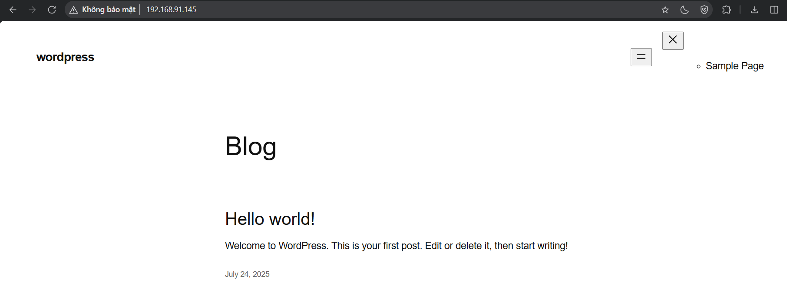
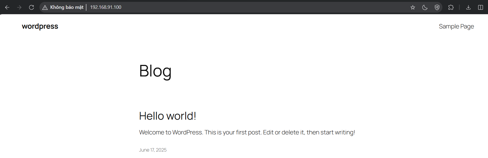
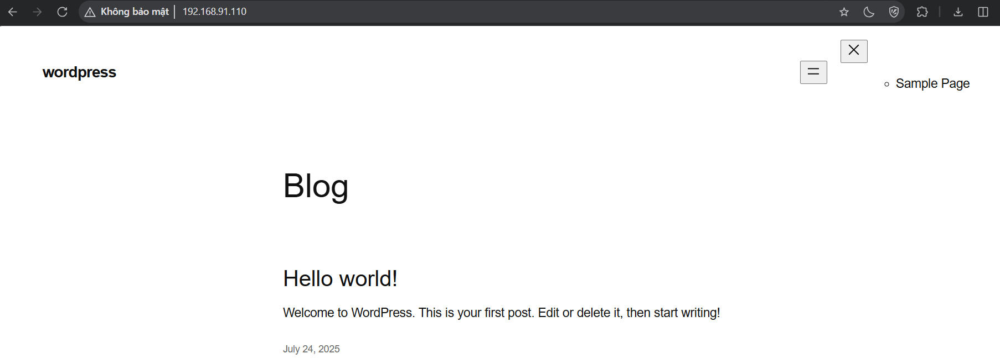
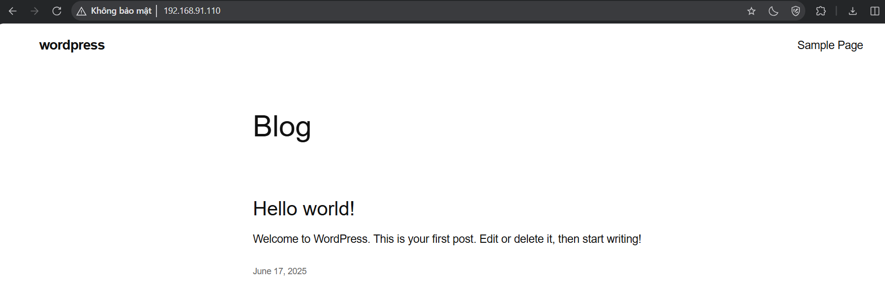

# Tìm hiểu về Wordpress HA 

## 1. WordPress HA là gì?

WordPress HA (High Availability) là kiến trúc triển khai WordPress đảm bảo khả năng sẵn sàng cao, nghĩa là website WordPress luôn hoạt động ổn định, giảm thiểu tối đa thời gian gián đoạn dịch vụ khi xảy ra lỗi phần cứng, lỗi mạng hoặc bảo trì.

## 2. Tại sao cần HA cho WordPress?

- Website không bị downtime, đảm bảo trải nghiệm người dùng.

- Hạn chế mất doanh thu (đối với website thương mại điện tử).

- Tăng độ tin cậy và uy tín của hệ thống.

## 3. Kiến trúc WordPress HA cơ bản:

### 3.1 Load Balancer (Cân bằng tải):

- Phân phối request đến nhiều server backend chạy WordPress.

- Ví dụ: Nginx, HAProxy hoặc AWS Elastic Load Balancing.

### 3.2 Nhiều Web Server chạy WordPress:

- Các instance WordPress chạy song song (ngang hàng).

- Mã nguồn đồng bộ qua NFS, EFS, GlusterFS hoặc CI/CD.

### 3.3 Database Cluster:

- MySQL replication (Master-Slave hoặc Multi-Master).

- Hoặc dùng dịch vụ Database Managed (Amazon RDS Multi-AZ).

### 3.4 Shared Storage (Lưu trữ chung):

- Chia sẻ thư mục wp-content/uploads giữa các node.

- Có thể dùng NFS, EFS (AWS), hoặc plugin đồng bộ S3.

### 3.5 Health Check + Failover:

- Giám sát dịch vụ, tự động chuyển hướng traffic khi server hỏng.

# Lab về Wordpress HA

## 1. Chuẩn bị

1 máy ảo cài đặt HAProxy để làm Load Balancer Server 

2 máy ảo cài đặt Wordpress để làm các node

| Máy ảo    | OS              | IP             | Vai trò                 |
| --------- | --------------- | -------------- | ----------------------- |
| web1      | CentOS Stream 9 | 192.168.91.145 | Web + NFS Server + DB   |
| web2      | Ubuntu 24.04    | 192.168.91.100 | Web + NFS Client        |
| lb-server | Ubuntu 24.04    | 192.168.91.110 | Load Balancer (HAProxy) |

## 2. Các bước triển khai

**Bước 1:** Cấu hình NFS Server trên web1 (CentOS + Nginx)

    sudo mkdir -p /var/www/wordpress
    sudo chown -R nobody:nobody /var/www/wordpress
    sudo chmod -R 755 /var/www/wordpress

    echo "/var/www/wordpress 192.168.91.0/24(rw,sync,no_root_squash)" | sudo tee -a /etc/exports

**Bước 2:** Cấu hình NFS Client trên web2 (Ubuntu)

    sudo apt install nfs-common -y
    sudo mkdir -p /var/www/wordpress

    sudo mount 192.168.91.145:/var/www/wordpress /var/www/wordpress
    echo "192.168.91.145:/var/www/wordpress /var/www/wordpress nfs defaults 0 0" | sudo tee -a /etc/fstab

**Bước 3:** Cài đặt MariaDB trên web1

    sudo dnf install mariadb-server -y
    sudo systemctl enable --now mariadb

    sudo mysql -u root -e "
    CREATE DATABASE wordpress;
    CREATE USER 'quyen'@'%' IDENTIFIED BY '06122003';
    GRANT ALL PRIVILEGES ON wordpress.* TO 'quyen'@'%';
    FLUSH PRIVILEGES;
    EXIT;"

**Bước 4:** Cài đặt WordPress + Web Server

**4.1 Trên web1 (CentOS + Nginx + PHP-FPM)**

    sudo dnf install nginx php php-fpm php-mysqlnd -y
    sudo systemctl enable --now nginx php-fpm

    cd /var/www/wordpress
    sudo curl -O https://wordpress.org/latest.tar.gz
    sudo tar -xzf latest.tar.gz --strip-components=1
    sudo chown -R nginx:nginx /var/www/wordpress

Cấu hình Nginx cho WordPress (`/etc/nginx/conf.d/wordpress.conf`):

    server {
        listen 80;
        server_name 192.168.91.145;

        root /var/www/wordpress;
        index index.php index.html;

        location / {
            try_files $uri $uri/ /index.php?$args;
        }

        location ~ \.php$ {
            include fastcgi_params;
            fastcgi_pass 127.0.0.1:9000;
            fastcgi_param SCRIPT_FILENAME $document_root$fastcgi_script_name;
        }
    }

Mở file `wp-config.php` trong thư mục gốc WordPress và sửa theo hướng dẫn dưới đây:

    define( 'DB_NAME', 'wordpress' );
    define( 'DB_USER', 'quyen' );
    define( 'DB_PASSWORD', '06122003' );
    define( 'DB_HOST', '127.0.0.1' );

Lưu ý: nếu không có file `wp-config.php`, sử dụng lệnh:

    sudo cp wp-config-sample.php wp-config.php

sudo nginx -t && sudo systemctl reload nginx

**4.2 Trên web2 (Ubuntu + Apache2 + PHP)**

    sudo apt install apache2 php libapache2-mod-php php-mysql -y

    sudo mkdir -p /var/www/wordpress
    sudo chown -R www-data:www-data /var/www/wordpress

    # Cấu hình Apache VirtualHost
    sudo tee /etc/apache2/sites-available/wordpress.conf <<EOF
    <VirtualHost *:80>
        ServerName 192.168.91.100
        DocumentRoot /var/www/wordpress

        <Directory /var/www/wordpress>
            AllowOverride All
            Require all granted
        </Directory>

        ErrorLog \${APACHE_LOG_DIR}/error.log
        CustomLog \${APACHE_LOG_DIR}/access.log combined
    </VirtualHost>
    EOF

    sudo a2ensite wordpress.conf
    sudo a2enmod rewrite
    sudo systemctl reload apache2

**Bước 5:** Cấu hình Load Balancer với HAProxy trên lb-server

    sudo apt update
    sudo apt install haproxy -y

Chỉnh cấu hình trong file `/etc/haproxy/haproxy.cfg`

Thêm vào cuối file:

    frontend wordpress_frontend
        bind *:80
        mode http
        default_backend wordpress_backend

    backend wordpress_backend
        mode http
        balance roundrobin
        option httpchk GET /
        server web1 192.168.91.145:80 check
        server web2 192.168.91.100:80 check

## 3. Kết quả đạt được

Web1: CentOS - 192.168.91.145

Web 2: Ubuntu - 192.168.91.100

Trên lb-server: Ubuntu - 192.168.91.110

